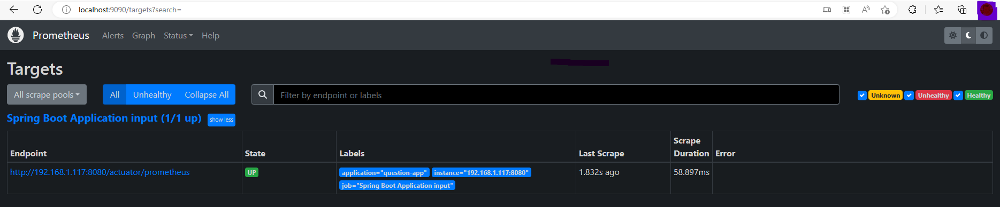
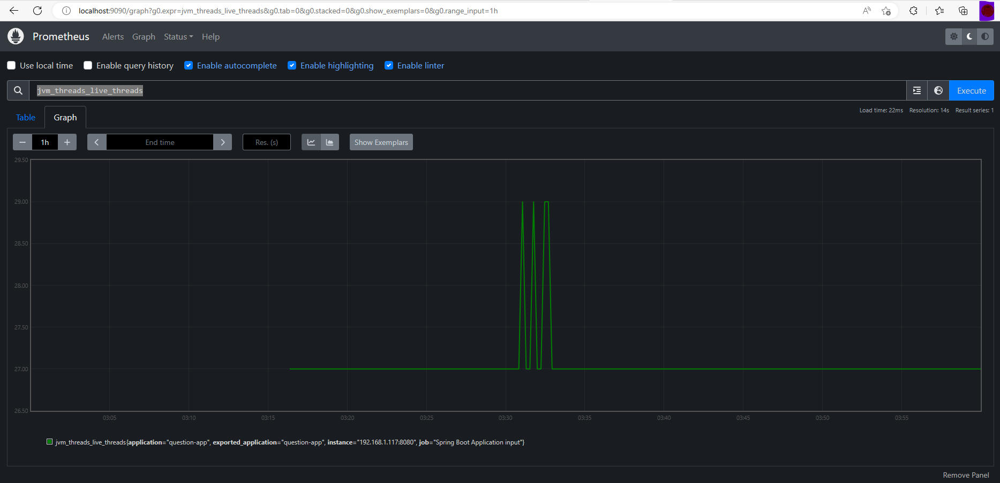
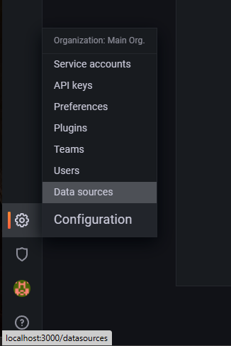
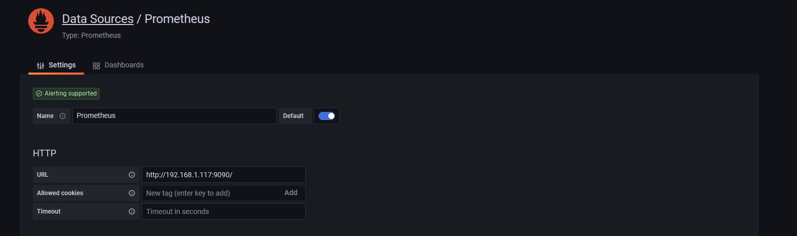
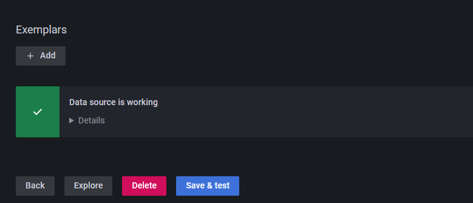
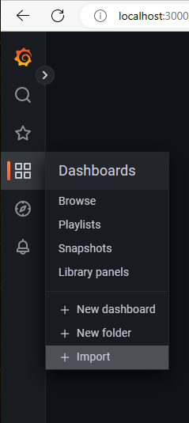
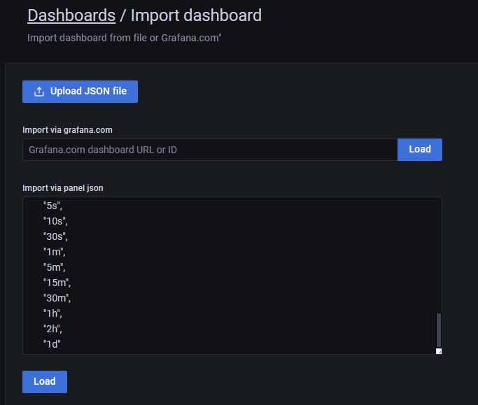
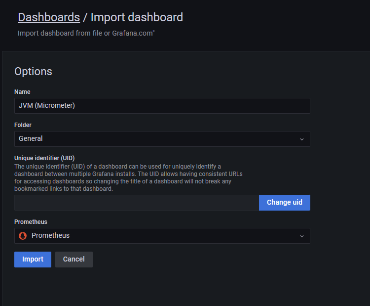
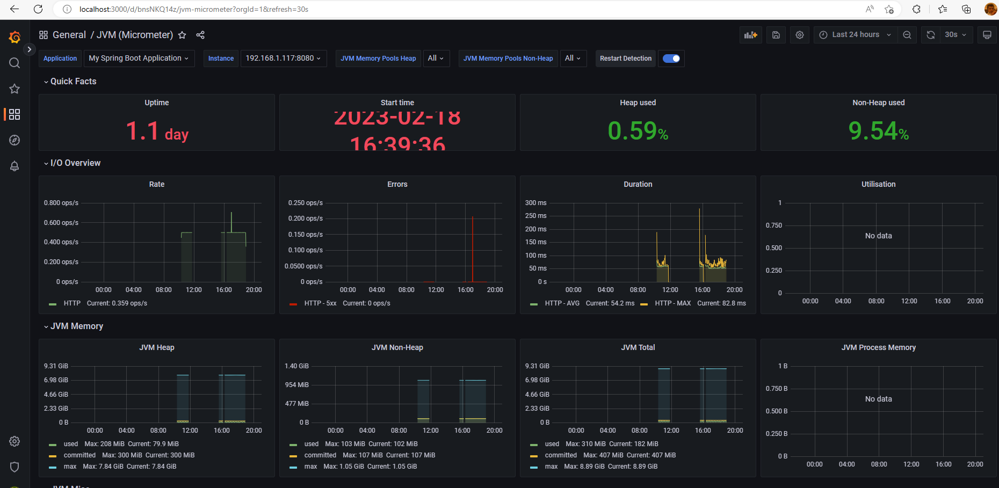

# Project Docker to start Prometheus and Grafana


## Steps to start servides

### Step 0

#### We need to enable actutor in youe Spring boot application

Spring boot Actuator
- [Actuator Documentation](https://docs.spring.io/spring-boot/docs/current/actuator-api/htmlsingle/)
- [Enabling actuator](https://www.appsdeveloperblog.com/how-to-enable-actuators-httptrace-in-spring-boot-3/)
  - [Prometheus Endpoint](http://localhost:8080/actuator/prometheus)
  - [Info Endpoint](http://localhost:8080/actuator/info)
  - [Health Endpoint](http://localhost:8080/actuator/prometheus)


### Step 1

Clone this repository
```shell
git clone https://github.com/Laboratorios-Gigabyte/docker-scripts.git
```

### Step 2
 
Change directory to prometheus-grafana directory
```shell
cd prometheus-grafana
```

### Step 3

We can take a look to this tutorial to understand, it is not updated, but we can follow the steps.
- [Sample Spring Boot/Prometheus/Grafana](https://youtu.be/pVdDWQQeqME)

We need to modify [Prometheus Config file](https://github.com/Laboratorios-Gigabyte/docker-scripts/blob/cd13da40679482bce89047edb7c78d1a66a7e667/prometheus-grafana/data/prometheus/config/prometheus.yml#L14) substitute the IP with the IP where your application is deployed.

To start Prometheus and Grafana
```shell
doker-compose up
```

### Step 4

- [Access Prometheus](http://localhost:9090/)
- [Verify that Prometheus is reading metrics from your application](http://localhost:9090/targets)


### Step 5 Execute Prometheus Query
If we access to the application's prometheus actuator [endpoint](http://localhost:8080/actuator/prometheus) we will be able to see
the metrics, comments start with #, so for example `process_start_time_seconds`, `jvm_threads_live_threads`


If we can see this kind of graphics we can be sure that Prometheus is working.

### Step 6 Grafana
- [Access Grafana](http://localhost:3000/), use `user = admin` and `password = admin`, we can change the password or `skip`
### Step 7 Configure datasource
We go to configuration and hit on `Add data source` and select `Prometheus`



### Step 8 Fill the required data
The only field we need to fill is the `url`, *we need to use the ip in your local network* in my case this is my ip `192.168.1.117`


### Step 9 Sava and test
No error should be displaying



### Step 10 Importing a Dashboard
Go to `Dashboards -> Import`



### Step 11 Paste Dashboard content

We need to copy [the contents of the file](dashboards/jvm-micrometer_rev9.json) into the text box and click `Load`



### Step 12
We can change the `name` the `folder` and we have to select the `data source` weh have created



### Step 13 Finally
